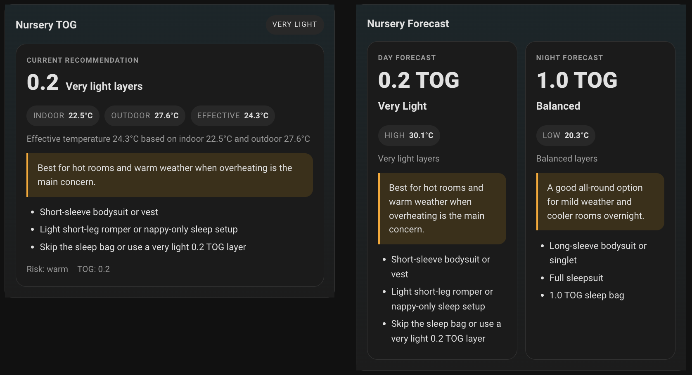
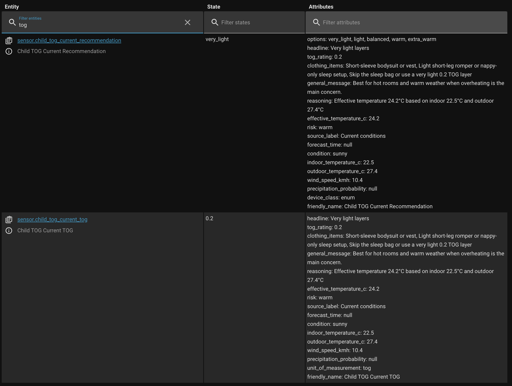
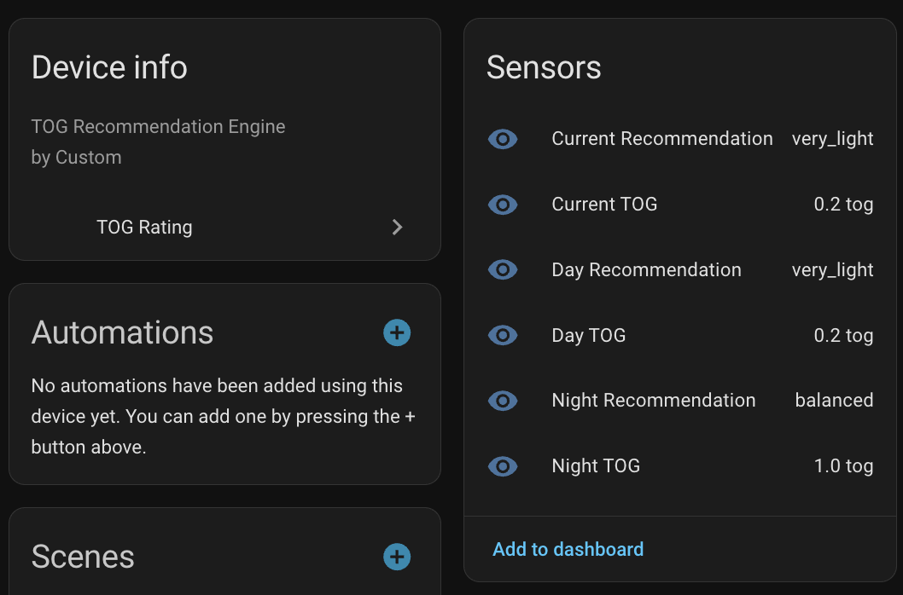

# TOG Rating

TOG Rating is a Home Assistant custom integration that turns an indoor temperature sensor, an outdoor temperature sensor, and a weather entity into child clothing guidance with current, day, and night TOG recommendations.

## Companion repositories

- Dashboard card: https://github.com/Anton2079/lovelace-tog-rating-card

## Screenshot

## HACS repository type

Add this repository to HACS as an `Integration` repository.

## Recommended GitHub repository settings

- Repository name: `tog-rating`
- Description: `Home Assistant integration for child clothing and TOG recommendations using indoor, outdoor, and weather forecast data.`
- Topics: `home-assistant`, `hacs`, `home-assistant-integration`, `tog`, `weather`, `parenting`

## What this repo contains

- `custom_components/tog_rating/`
- `hacs.json`
- HACS validation workflow
- placeholder brand icon in `brands/tog_rating/icon.png`

## Installation

1. In HACS, add this repository as a custom repository.
2. Choose repository type `Integration`.
3. Install `TOG Rating`.
4. Restart Home Assistant.
5. Go to Settings > Devices & Services and add `TOG Rating`.

## Companion dashboard card

This integration repo does not install the Lovelace card. Install the companion dashboard card from:

- https://github.com/Anton2079/lovelace-tog-rating-card

## Before first public release

1. Replace `brands/tog_rating/icon.png` with a real icon.
2. Set the GitHub repository description and topics.
3. Create a GitHub release such as `v0.1.0`.
4. Optionally add screenshots and a My Home Assistant HACS link.